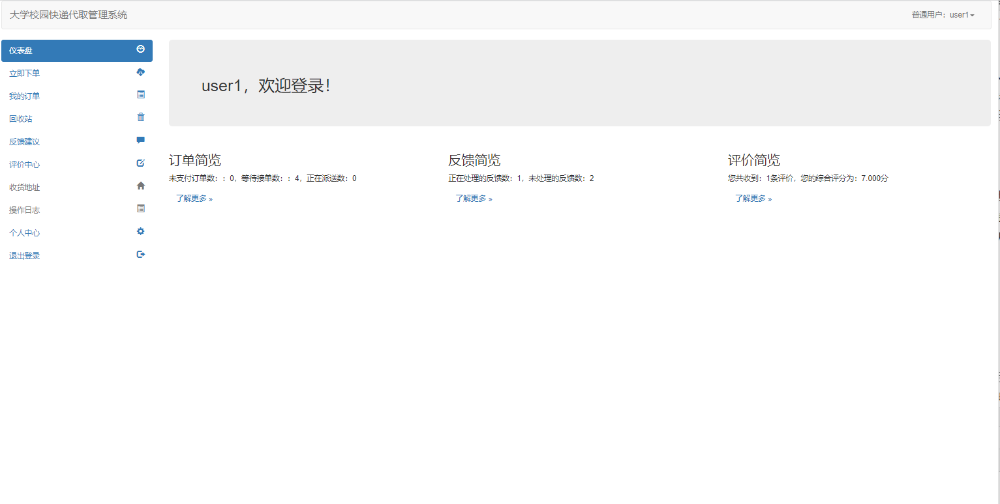
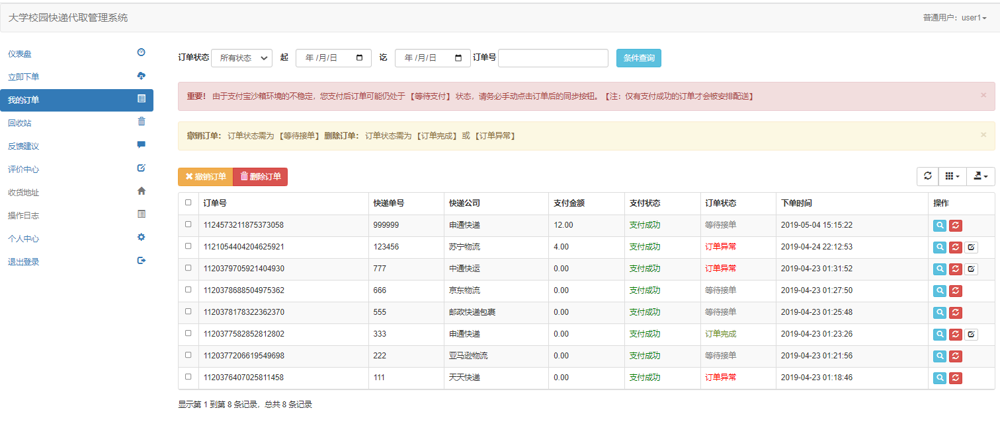
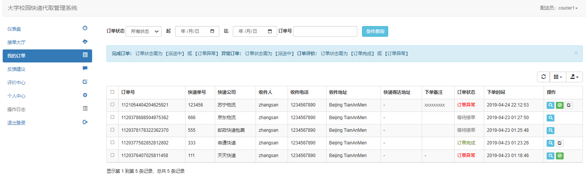
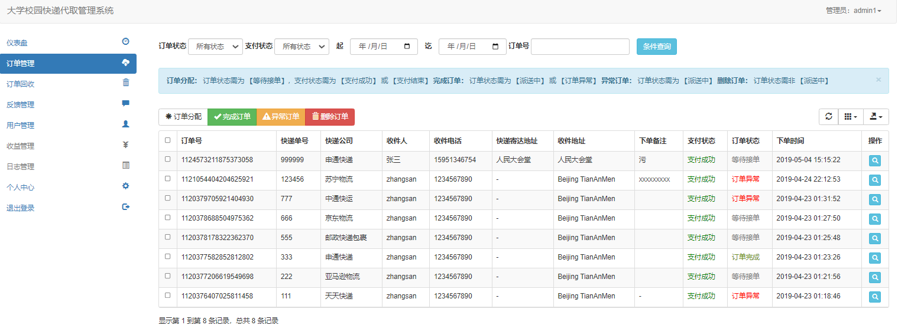

**需要完整代码可以加qq  931708230 或者加微信 ynwwxid**

**需要完整代码可以加qq  931708230 或者加微信  ynwwxid**

## 快递代拿系统

> 该项目基于[[express-ssm]](https://github.com/ynwynw/express-ssm) 项目全面升级，使用当前最为流行的 SpringBoot 框架，相关技术栈全面更新！是您深入学习 SpringBoot 开发的最佳实践！

### 相关技术栈

1. **前端：** Thymeleaf、Bootstrap、Ajax、JQuery
2. **开发环境：** IDEA 、SpringBoot 2.1、Maven
3. **数据库与缓存**：MySQL 5.7、Redis、Guava Cache
4. **三方服务**：腾讯云短信服务、支付宝支付（沙箱）、百度人脸识别
5. **安全框架**：Spring Security
6. **其他技术**：API 接口限速、二级缓存

### 主要功能

1. **登陆与注册：** 用户名密码、短信验证码、人脸识别登录、QQ登录
2. **权限：** 普通用户、配送员、后台管理员
3. **普通用户**：下单支付、订单查询、意见反馈、订单评价
4. **配送员**：接单、订单管理、意见反馈、订单评价
5. **系统管理员**：用户管理、订单管理、反馈管理

### 默认用户

当您运行初始脚本后，默认存在以下用户，便于测试：
登录地址 ：http://localhost:8110/

|  登录名  | 密码 | 用户角色 |
| :------: | :--: | :------: |
|  user1   | 123  | 普通用户 |
|  user2   | 123  | 普通用户 |
| courier1 | 123  | 配送用户 |
|  admin1  | 123  |  管理员  |

### 项目运行












#### 必读

为最大限度降低大家学习门槛，公开提供了**支付宝支付**和**QQ登录**的配置信息，也就说以下配置流程中你可以略去支付宝配置和QQ登录配置，使用默认配置即可。

百度人脸登录和短信登录由于涉及隐私和费用问题，不予公开，需要大家自己按照流程去申请。

#### 配置文件初始化

本项目支持多环境配置，由于牵扯隐私，dev 环境和 prod 环境的配置文件没有上传到仓库中，因此当你 clone 项目后，新建配置文件 `application-dev.yaml`，并将 `application-test.yaml`内容复制进去。

后续配置修改只需修改 `application-dev.yaml` 即可。

#### 数据库配置【必须】

1. 本地安装 MySQL 环境，所需版本为 `5.7+`

2. 创建数据库名为 `express`，数据库编码采用 `utf8mb4`，排序规则为 `utf8mb4_general_ci`

   ```
   CREATE DATABASE IF NOT EXISTS express default charset utf8mb4 COLLATE utf8mb4_general_ci;
   ```

3. 导入项目中 `/src/main/resources/db/express.sql` 到 `express`库。

   **注：不要使用 Navicat 等图形化导入工具（会导致导入失败），请使用 source 命令！！**

   ```powershell
   use express; # 选择数据库
   source /your/path/express.sql; # Source 导入
   ```

4. 编辑 `application-dev.yaml` 文件，修改数据库连接信息。

   ```yaml
   datasource:
       driver-class-name: com.mysql.cj.jdbc.Driver # MySQL驱动，无需修改
       # 数据库连接URL，以下为连接本地的 express 库的 url 示例
       url: jdbc:mysql://localhost:3306/express?useUnicode=true&characterEncoding=utf-8&useSSL=true&serverTimezone=GMT%2B8
       username: root # 数据库连接名
       password: root # 数据库连接密码
   ```

#### Redis配置【必须】

1. 本地安装 Redis 环境，如果你使用的是 Windows 平台，请[点击这里](<https://github.com/MicrosoftArchive/redis/releases>)下载 Windows 版本。如果是 Linunx or Mac 系统，请自行百度即可。

2. 编辑 `application-dev.yaml` 文件，修改 Redis 连接信息。

   ```yaml
   redis:
     host: 127.0.0.1 # Redis地址，本地为127.0.0.1
     port: 6379 # Redis端口号，默认为6379
     password: # Redis密码，没有请保持为空
     ...
   ```

#### 支付宝支付【默认已配置，可跳过】

支付宝支付为快递下单的支付方式，因此必须配置，这里采用支付宝的沙箱模式：

```yaml
alipay:
  uid: # 商户UID
  app-id: # APPID
  sign-type: RSA2
  gateway-url: https://openapi.alipaydev.com/gateway.do # 支付宝网关
  merchant-private-key: # 商户私钥，使用密钥生成工具得到
  alipay-public-key: # 支付宝公钥
  notify-url: ${server.addr}/order/alipay/notify # 支付异步通知URL，需公网能够访问
  return-url: ${server.addr}/order/alipay/return # 同步通知URL，无需公网访问
```

其中 `notify-url` 和 `return-url`为支付宝的支付同步回调和异步回调，请根据自己需求修改 Url 前缀即可，即 `${server.addr}` 部分。

例如，当你处于本地启动，端口号为 8080 时，`notify-url` 和 `return-url` 保持不变，可以接受到同步回调，但是无法接收异步回调。

> 详细流程请参考文章：[Java Web中接入支付宝支付](<https://blog.csdn.net/yuanlaijike/article/details/80575513>)

#### QQ 登录【默认已配置，可跳过】

如需配置QQ登录功能，请按以下步骤操作：

（1）登录[QQ互联管理中心](<https://connect.qq.com/manage.html#/>)，创建 **网站应用**。

（2）网站地址为程序配置文件中配置的 `server.add` 属性，例如本地启动，且端口号为 8080 时，则填写为：

```
http://127.0.0.1:8080
```

（3）网站回调域为`${server.addr}/auth/third-login/qqCallback`，当本地启动，且端口号为8080时，填写为：

```
http://127.0.0.1:8080/auth/third-login/qqCallback
```

（4）点击**创建应用**按钮即可。即使提示正在审核，或者审核失败也可以正常使用，仅限申请者的QQ号登录。

（5）编辑 `application-dev.yaml` 文件，将 `app-id` 和 `app-key` 替换为创建应用时得到的即可：

```yaml
third-login:
  qq:
    app-id: # APP_ID
    app-key: # APP_KEY
```

> 详细流程请参考文章：[Web三方登录实现（基于OAuth2.0，包含Github和QQ登录，附源码）](<https://blog.csdn.net/yuanlaijike/article/details/80413181>)

#### 短信登录【可选】

（1）登录[腾讯云短信服务](<https://console.cloud.tencent.com/sms>)

（2）根据[官方指南](<https://cloud.tencent.com/document/product/382/18061>)，成功**创建应用**、**短信签名**和**短信正文**后，编辑 `application.yaml`文件：

```yaml
sms:
  app-id: # 应用 SDK AppID
  app-key: # 应用 App Key
  template-id: # 短信正文ID
  sign: # 短信签名
```

（3）`application-dev.yaml` 中，以下两项是控制短信的发送间隔和短信的有效时间，请合理配置。

```yaml
sms:
  # 短信发送分钟间隔
  interval-min: 1
  # 短信有效分钟
  valid-min: 5
```

**注意事项**

1. `sms.sign` 必须为经过审核的短信签名，否则可能会导致发送失败
2. 短信正文设置建议参考以下，这是因为**程序中限定了发送短信时参数一为短信验证码，参数二为过期时间**。如果你想改变参数的个数或顺序，请修改`com.example.express.service.impl.SmsServiceImpl#send`方法。

```
{1}为您的登录验证码，请于{2}分钟内填写。如非本人操作，请忽略本短信。
```

#### 人脸登录【可选】

1. 登录[百度人脸识别](<https://cloud.baidu.com/product/face>)
2. 创建应用后，修改`application-dev.yaml`文件，复制应用的 `AppID`、`API Key`、`Secret Key`到相对应项。
3. `conn-timeout` 和 `socket-timeout` 为连接超时时间，如无特殊需求，保持默认值即可。
4. `accept-score` 为最低被接受的置信分数，该分数用于人脸登录，只有置信分到达阈值时才能登录成功。如无特殊需求，保持在90以上即可。

```yaml
baidu:
  aip:
    app-id: # 应用 APPID
    app-key: # 应用API KEY
    secret-key: # 应用 Secret Key
    conn-timeout: 2000 # 连接超时ms，默认 2000
    socket-timeout: 60000 # socket超时ms，默认60000
    # 最低被接受的人脸置信分数[1,100]，分数越高，要求越严格，也越准确。
    accept-score: 90
```

1. 基础环境 :IDEA，maven3.6，JDK 1.8 ， Mysql 5.7

   ### 源码+数据库脚本 

   所有项目以及源代码本人均调试运行无问题 可支持远程调试运行

   **需要完整代码可以加qq  931708230 或者加微信 ynwwxid**

   **需要完整代码可以加qq  931708230 或者加微信  ynwwxid**
